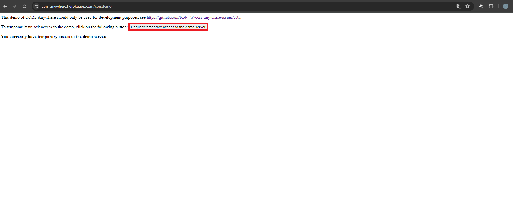

# Previsão Meteorológica :sun_behind_large_cloud:

## Instruções de Instalação

1. Após clonar o repositório em sua máquina local, abra o terminal na pasta do projeto.

2. Execute o comando  ```npm install```  para instalar todas as dependências do projeto.

3. Após a conclusão da instalação das dependências, execute o comando ```npm start``` .

4. A aplicação será iniciada e estará acessível em: http://localhost:5173/.

5. Copie e cole o endereço no navegador de sua preferência para visualizar a aplicação em execução.

:warning: **Atenção:** Antes de fazer uma consulta será necessario acessar: https://cors-anywhere.herokuapp.com/corsdemo e seguir o passo a passo no site para liberar o uso da API de clima 



## Instruções de Uso


A imagem acima ilustra a interface inicial do site. Para consultar a previsão do tempo de uma cidade específica, insira o nome da cidade desejada no campo destacado em verde e, em seguida, clique no botão 'Consultar'. O mapa será automaticamente ajustado para exibir a localização da cidade inserida, e as informações meteorológicas correspondentes serão exibidas no card localizado na parte superior esquerda da tela.

Para consultar novamente uma cidade previamente pesquisada com sucesso, utilize o campo de seleção destacado em vermelho e escolha a cidade desejada na lista fornecida. Tanto o card quanto o mapa se comportarão da mesma forma como quando a cidade foi consultada inicialmente através do botão de consulta.


